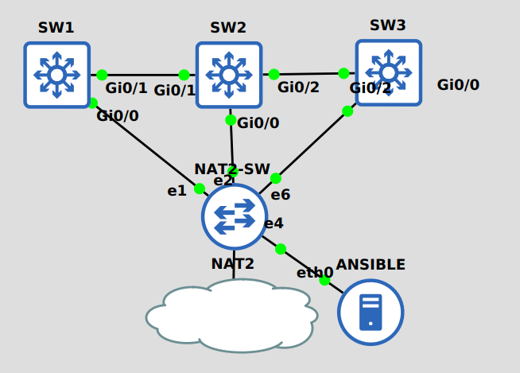

## Preconfig

This is the topology of this lab.



Each host must be accessible via SSH using public key authentication.
[SSH Public Key Authentication on Cisco IOS](https://networklessons.com/uncategorized/ssh-public-key-authentication-cisco-ios)

This is the configuration example:
```
en
conf t
line con 0 
logging syn
line vty 0 15
loggin syn
login local
username rizqi privilege 15 secret cisco123
int g0/0
no sw
ip add dhcp 
int g3/0
no sw
ip add 192.168.30.1 255.255.255.0
ip domain name idn.id
crypto key gen rsa mod 2048

ip ssh pubkey-chain
username rizqi
key-string
AAAAB3NzaC1yc2EAAAADAQABAAABAQC+znCrAL1HKCHAMi2cRXK9l9wzZvfx6Wy+
eoWXBqhJvqsspXuJlj3QMYBDXbjSKwXsrvuU5DeOUwRBMWe840Lu8RUxyipoHVha3j4I/XwU
ElSQg6qkq+oDGQ+azBWe8B1XFgRRC1Y+6Z3yT3tmgxQXdk0sCRIZC4mBVSq+SckOkVBl46iE
auQ3AeFNN7PauV+mISDuJSPO25dDQe+GgidTFoS6gJvQxZQMA6DeCNmSeIg7VvnMj7Y90Z+a
wSfy7pvj9jpNbESkDmOogtkrRz6k30mV9eWoEAYG8zSarPrtA5HdXh3RmHNoN3yhx0DIHS4W
zWl09v+dtokLctXO9jJb
exit
exit
exit
```

